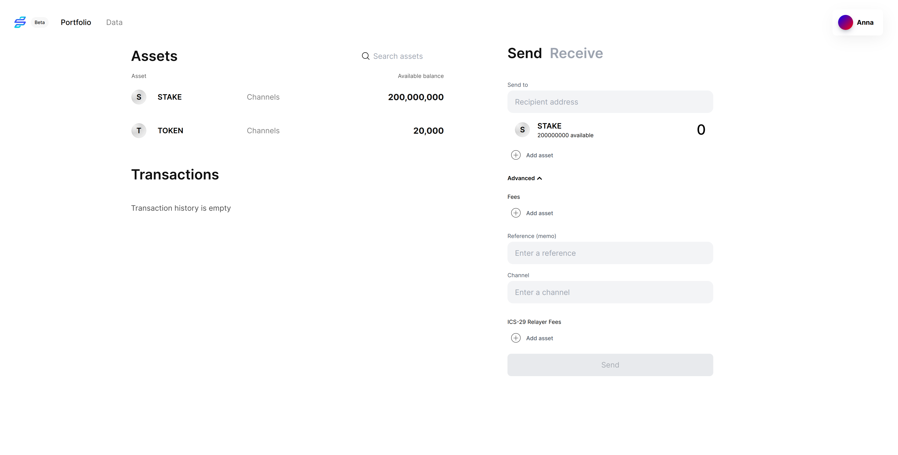

# Wire up ICS-29 Fee to the React app

Our goal is to create a React component that will allow users to select their ICS-29 fee amount and pay it. The final component will look like this:



## 1. Create the State for ICS-29 Fee

We will do all our modifications in the `src/components/IgntSend.tsx` file. First, we need to create a state for the fee amount. Add the following line to the `IgntSend` component:

```ts title="src/components/IgntSend.tsx"
interface TxData {
  receiver: string;
  ch: string;
  amounts: Array<Amount>;
  memo: string;
  fees: Array<Amount>;
  // plus-diff-line
+ relayerFee: Array<Amount>;
}
```

```ts title="src/components/IgntSend.tsx"
const initialState: State = {
  tx: {
    receiver: "",
    ch: "",
    amounts: [],
    memo: "",
    fees: [],
	// plus-diff-line
+   relayerFee: [],
  },
  currentUIState: UI_STATE.SEND,
  advancedOpen: false,
};
```

## 2. Add the ICS-29 Fee UI

Next, we need to add a functional UI which updates the fee amount in the state. Add the following code to the `IgntSend` component:

```ts title="src/components/IgntSend.tsx"
  const handleTxFeesUpdate = (selected: Amount[]) => {
    setState((oldState) => {
      const tx = oldState.tx;
      tx.fees = selected;
      return { ...oldState, tx };
    });
  };
  // plus-diff-start
+ const handleTxRelayerFeesUpdate = (selected: Amount[]) => {
+   setState((oldState) => {
+     const tx = oldState.tx;
+     tx.relayerFee = selected;
+     return { ...oldState, tx };
+   });
+ };
  // plus-diff-end
```

```tsx title="src/components/IgntSend.tsx"
            <div className="text-xs text-gray-600">Channel</div>

            <div className="input-wrapper">
              <input
                className="mt-1 py-2 px-4 h-12 bg-gray-100 border-xs text-base leading-tight w-full rounded-xl outline-0"
                placeholder="Enter a channel"
                onChange={(evt) => {
                  setState((oldState) => {
                    const tx = oldState.tx;
                    tx.ch = evt.target.value;
                    return { ...oldState, tx };
                  });
                }}
              />
            </div>
			// plus-diff-start
+ 
+           <div className="text-xs pb-2 mt-8">ICS-29 Relayer Fees</div>
+ 
+           <IgntAmountSelect
+             className="token-selector"
+             selected={state.tx.relayerFee}
+             balances={balances.assets as Amount[]}
+             update={handleTxRelayerFeesUpdate}
+           />
			// plus-diff-end
```

At this point, you should be able to see the ICS-29 fee UI in the app. See the diff up to this point [here](https://github.com/srdtrk/cosmoverse2023-ibc-fee-demo/commit/a93acb8e1b4194402a45506c5c3105b4dc03ad58). However, the fee amount is not being used in the transaction. Let's fix that.

## 3. Add the ICS-29 Fee to the transaction

Since we will perform a `MultiMsgTx` and follow the [immediate incentivization flow](https://ibc.cosmos.network/v7.3.x/middleware/ics29-fee/msgs#escrowing-fees), we must import the required msg constructors from the `ts-client`.

```ts title="src/components/IgntSend.tsx"
export default function IgntSend(props: IgntSendProps) {
  const [state, setState] = useState(initialState);
  const client = useClient();
  const sendMsgSend = client.CosmosBankV1Beta1.tx.sendMsgSend;
  const sendMsgTransfer = client.IbcApplicationsTransferV1.tx.sendMsgTransfer;
  // plus-diff-start
+ const msgTransfer = client.IbcApplicationsTransferV1.tx.msgTransfer;
+ const msgPayPacketFee = client.IbcApplicationsFeeV1.tx.msgPayPacketFee;
  // plus-diff-end
  const { address } = useAddressContext();
  const { balances } = useAssets(100);
```

Recall that the `PayPacketFee` message allows defining different tokens and amounts for each fee type (`RecvFee`, `AckFee`, and `TimeoutFee`). We will use the same amount for all three fee types.

The amount used will be half the amount of the `relayerFee` selected by the user. This is because one of `AckFee` or `TimeoutFee` will necessarily be refunded to the user since a packet either timeouts or receives acknowledgement but not both.

```ts title="src/components/IgntSend.tsx"
  const sendTx = async (): Promise<void> => {
    const fee: Array<Amount> = state.tx.fees.map((x) => ({
      denom: x.denom,
      amount: x.amount == "" ? "0" : x.amount,
    }));

    const amount: Array<Amount> = state.tx.amounts.map((x) => ({
      denom: x.denom,
      amount: x.amount == "" ? "0" : x.amount,
    }));

    // plus-diff-start
+   const relayerFee: Array<Amount> = state.tx.relayerFee.map((x) => {
+     const intAmount = x.amount == "" ? 0 : parseInt(x.amount, 10);
+     const newAmount = Math.floor(intAmount / 2);
+     return {
+       denom: x.denom,
+       amount: newAmount.toString(),
+     };
+   });
+
    // plus-diff-end
```

Now that the fee amount is defined, we can build the tx. Currently, the way that the react app works is it checks whether or not a channel has been provided. If it has, it will send a `MsgTransfer` message (`isIBC = true`). Otherwise, it will send a `MsgSend` message (`isIBC = false`).
We will do something similar. We will check if `relayerFee` has been provided, if it is provided, and if `isIBC = true`, then we will build a `MultiMsgTx` with `PayPacketFee` and `MsgTransfer`.

```ts title="src/components/IgntSend.tsx"
    const memo = state.tx.memo;

    const isIBC = state.tx.ch !== "";

	// plus-diff-start
+   const isFee = state.tx.relayerFee.length > 0;
+
    // plus-diff-end
    let send;

    let payload: any = {
      amount,
      toAddress: state.tx.receiver,
      fromAddress: address,
    };
    setState((oldState) => ({ ...oldState, currentUIState: UI_STATE.TX_SIGNING }));
    try {
      if (isIBC) {
        payload = {
          ...payload,
          sourcePort: "transfer",
          sourceChannel: state.tx.ch,
          sender: address,
          receiver: state.tx.receiver,
          timeoutHeight: 0,
          timeoutTimestamp: Long.fromNumber(new Date().getTime() + 60000).multiply(1000000),
          token: state.tx.amounts[0],
        };

		// minus-diff-start
-       send = () =>
-         sendMsgTransfer({
-           value: payload,
-           fee: { amount: fee as Readonly<Amount>[], gas: "200000" },
-           memo,
-         });
		// minus-diff-end
		// plus-diff-start
+       if (isFee) {
+         const payFeeMsg = msgPayPacketFee({
+           value: {
+             signer: address,
+             sourcePortId: "transfer",
+             sourceChannelId: state.tx.ch,
+             relayers: [],
+             fee: {
+               recvFee: relayerFee,
+               ackFee: relayerFee,
+               timeoutFee: relayerFee,
+             },
+           },
+         });
+
+         const transferMsg = msgTransfer({
+           value: payload,
+         });
+
+         send = () =>
+           client.signAndBroadcast(
+             [payFeeMsg, transferMsg],
+             { amount: fee as Readonly<Amount>[], gas: "200000" },
+             memo,
+           );
+       } else {
+         send = () =>
+           sendMsgTransfer({
+             value: payload,
+             fee: { amount: fee as Readonly<Amount>[], gas: "200000" },
+             memo,
+           });
+       }
	    // plus-diff-end
      } else {
```

See the diff up to this point [here](https://github.com/srdtrk/cosmoverse2023-ibc-fee-demo/commit/0b3ddc8f8fe547624ec0d38f08e2344d29d22ee7). We will test the UI in the next section.
