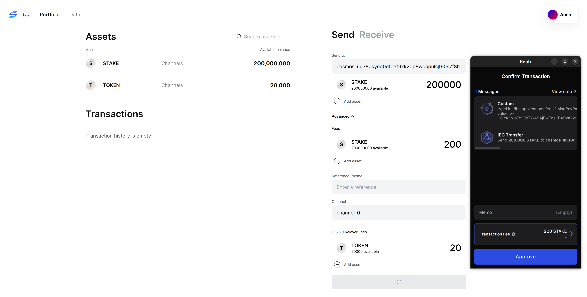

import HighlightBox from '@site/src/components/HighlightBox';

# Testing the React app

<HighlightBox type="learning" title="Learning Goals">

In this section, you will:

- Run two chains locally.
- Configure and run a relayer.
- Make an incentivized IBC transfer between the two chains.

</HighlightBox>

In this section, we will test the React app we created in the previous section. We will run two chains locally, configure and run a relayer, and make an incentivized IBC transfer between the two chains.
You can find the React app we created in the previous section [here](https://github.com/srdtrk/cosmoverse2023-ibc-fee-demo)

## Run two chains locally

Ignite supports running multiple chains locally with different configs. The source chain will be called earth and the destination chain will be called mars.
Add the following config files to the root of the project:

```yaml reference title="earth.yml"
https://github.com/srdtrk/cosmoverse2023-ibc-fee-demo/blob/96cb63bf2e60b4613a89841416066551dd666c0d/earth.yml
```

```yaml reference title="mars.yml"
https://github.com/srdtrk/cosmoverse2023-ibc-fee-demo/blob/96cb63bf2e60b4613a89841416066551dd666c0d/mars.yml
```

To run the chains, use the following commands and quit with `q`:

```bash
ignite chain serve -c earth.yml --reset-once
```

```bash
ignite chain serve -c mars.yml --reset-once
```

## Configure Hermes

We first need to create a relayer configuration file. Add the following file to the root of the project:

```toml reference title="hermes/config.toml"
https://github.com/srdtrk/cosmoverse2023-ibc-fee-demo/blob/960d8b7e148cbe2207c3a743bac7c0985a5b653a/hermes/config.toml
```

We can move this file to the `~/.hermes` directory to avoid having to specify the path to the config file every time we run the relayer:

```bash
mkdir -p ~/.hermes
cp hermes/config.toml ~/.hermes/config.toml
```

Otherwise, we can specify the path to the config file with the `--config` flag in each command. Next, we need to add keys to hermes.
We will add `charlie` key to the `earth` chain and `damian` key to the `mars` chain. Add the following files to the project:

```text reference title="hermes/charlie.mnemonic"
https://github.com/srdtrk/cosmoverse2023-ibc-fee-demo/blob/960d8b7e148cbe2207c3a743bac7c0985a5b653a/hermes/charlie.mnemonic
```

```text reference title="hermes/damian.mnemonic"
https://github.com/srdtrk/cosmoverse2023-ibc-fee-demo/blob/960d8b7e148cbe2207c3a743bac7c0985a5b653a/hermes/damian.mnemonic
```

We can add these keys to the chains with the following commands:

```bash
hermes keys add --key-name charlie --chain earth --mnemonic-file hermes/charlie.mnemonic
```

```bash
hermes keys add --key-name damian --chain mars --mnemonic-file hermes/damian.mnemonic
```

## Test the app

Prepare 4 terminal windows and run the following commands in each of the first three:

```bash title="Terminal 1"
ignite chain serve -c earth.yml --reset-once
```

```bash title="Terminal 2"
ignite chain serve -c mars.yml --reset-once
```

```bash title="Terminal 3"
cd react
npm run dev
```

The last terminal will be used to run the relayer. First, we will create the client, connection, and channel between the two chains by running:

```bash title="Terminal 4"
hermes create channel --channel-version '{"fee_version":"ics29-1","app_version":"ics20-1"}' --a-chain earth --b-chain mars --a-port transfer --b-port transfer --new-client-connection --yes
```

This will create an incentivized IBC transfer channel between the two chains with the channel id `channel-0`, and channel version `{"fee_version":"ics29-1","app_version":"ics20-1"}`.
Next recall that the Fee Middleware only pays fees on the source chain. That's why we should register `damian` and `charlie` as each other's counterparty on both chains.

```bash title="Terminal 4"
hermes fee register-counterparty-payee --chain mars --channel channel-0 --port transfer --counterparty-payee cosmos1vapwvcsr0m32ptal6z6g9hjctywrw4yzyf6y6v
```

```bash title="Terminal 4"
hermes fee register-counterparty-payee --chain earth --channel channel-0 --port transfer --counterparty-payee cosmos1uu38gkyed0dte5f9xk20p8wcppulsjt90s7f8h
```

Now we can run the relayer with the following command:

```bash title="Terminal 4"
hermes start
```

We can now use the react app to make an incentivized IBC transfer from `anna` on the `earth` chain to `bo` on the `mars` chain. After which, we can use the frontend to view the balance of `charlie` to see if they've received the fee.
Don't forget to quit all the processes after the test is done.


